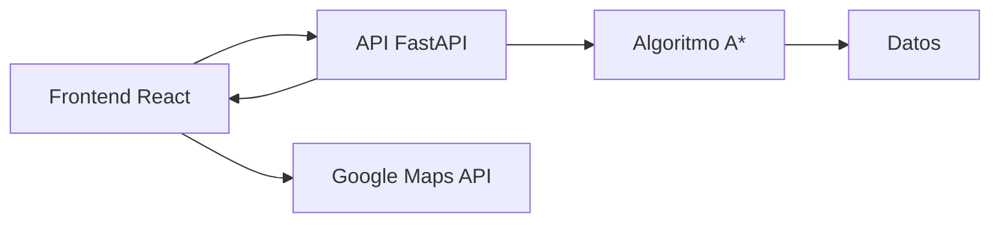

# SubteBA Path 🚇

## Descripción
SubteBA Path es una aplicación web que permite calcular y visualizar la ruta óptima entre dos estaciones del sistema de metro (Subte) de Buenos Aires utilizando el algoritmo A*. La aplicación considera diversos factores como transbordos, longitud del recorrido y accesibilidad para proporcionar la mejor ruta posible.

## Características principales
- 🗺️ Visualización interactiva del mapa del Subte de Buenos Aires
- 🔍 Búsqueda inteligente de rutas usando el algoritmo A*
- 🔄 Consideración de transbordos y conexiones entre líneas
- ⏱️ Estimación de tiempos de viaje
- ♿ Información sobre accesibilidad de las estaciones
- 📱 Interfaz responsive adaptable a diferentes dispositivos

## Tecnologías utilizadas
### Frontend
- React.js
- Tailwind CSS
- Google Maps API (para visualización de mapas)

### Backend
- Python (FastAPI)

### Herramientas de desarrollo
- Vite (bundling y desarrollo frontend)
- Git (control de versiones)

## Estructura del proyecto
```
subte-ba-path/
├── frontend/                # Aplicación React
│   ├── src/
│   ├── public/
│   └── package.json
├── backend/                 # API FastAPI
│   ├── app/
│   │   ├── algorithms/      # Implementación A*
│   │   ├── config/        
│   │   ├── data/        
│   │   ├── repositories/        
│   │   ├── routers/        
│   │   └── services/
│   ├── main.py
└── requirements.txt
```

## Instalación y configuración

### Requisitos previos
- Python 3.8 o superior
- Node.js 16 o superior

## Instalación
### Clonar el repositorio 
##### HTTPS
```bash
git clone https://github.com/sgarnica1/subteBA-path.git
```
##### SSH
```bash
git clone git@github.com:sgarnica1/subteBA-path.git
```
### Configurar el backend:
```bash
cd backend
```
#### Crear un entorno virtual (Recomendado)
##### Windows
```bash
py -m venv venv
venv\Scripts\activate
```
##### macOS/Linux
```bash
python3 -m venv venv
source venv/bin/activate
```
#### Instalar dependencias
##### Windows
```bash
pip install -r requirements.txt
```
##### macOS
```bash
xcode-select --install
pip install -r requirements.txt
```
##### Linux
```bash
sudo apt update && sudo apt install python3-dev build-essential libpq-dev
pip install -r requirements.txt
```

#### Iniciar el servidor
``` bash
uvicorn app.main:app --host 0.0.0.0 --port 8000
```

#### Comprobar backend
``` bash
curl http://localhost:8000/docs
```

### Configurar el frontend:
```bash
cd frontend
```
#### Crear un archivo `.env` con las siguientes variables
``` bash
VITE_GOOGLE_MAPS_API_KEY=<tu_api_key_de_google_maps>
VITE_SUBTE_API_URL=http://localhost:8000
```
#### Instalar pnpm
```bash
npm install -g pnpm
```
#### Instalar dependencias y ejecutar la aplicación
```bash
pnpm install
pnpm run dev
```


## Uso
1. Acceder a la aplicación web (por defecto en `http://localhost:5173`)
2. Seleccionar estación de origen
3. Seleccionar estación de destino
4. Visualizar la ruta óptima calculada

## Arquitectura del sistema


## Autores
| Apellidos           | Nombre | Matrícula | Email                      | Grupo  |
| ------------------- | ------ | --------- | -------------------------- | ------ |
| Tahri Jautei Hassan | Mamoun | 220129    | mamoun.t@alumnos.upm.es    | 5S2M-B |
| El Fakhouri         | Adam   | 220107s   | adam.elf@alumnos.upm.es    | 5S2M-B |
| Blay González       | Álvaro | 220469    | alvaro.blay@alumnos.upm.es | 5S1M   |
| Anaam               | Farid  | 210321    | farid.anaam@alumnos.upm.es | 5S2M-B |
| Garnica González    | Sergio | 240817    | s.garnica@alumnos.upm.es   | 5S1M-B |

## Licencia
Este proyecto está bajo la Licencia MIT - ver el archivo [LICENSE](LICENSE) para más detalles.

## Agradecimientos
- Universidad Politécnica de Madrid
- Profesores y compañeros de la asignatura de Inteligencia Artificial
