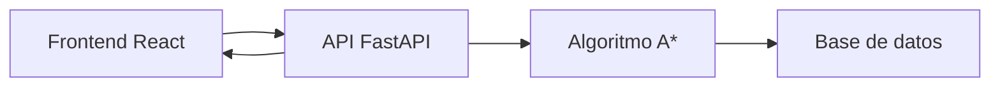

# SubteBA Path 🚇

## Descripción
SubteBA Path es una aplicación web que permite calcular y visualizar la ruta óptima entre dos estaciones del sistema de metro (Subte) de Buenos Aires utilizando el algoritmo A*. La aplicación considera diversos factores como transbordos, longitud del recorrido y accesibilidad para proporcionar la mejor ruta posible.

## Características principales
- 🗺️ Visualización interactiva del mapa del Subte de Buenos Aires
- 🔍 Búsqueda inteligente de rutas usando el algoritmo A*
- 🔄 Consideración de transbordos y conexiones entre líneas
- ⏱️ Estimación de tiempos de viaje
- ♿ Información sobre accesibilidad de las estaciones
- 📱 Interfaz responsive adaptable a diferentes dispositivos

## Tecnologías utilizadas
### Frontend
- React.js
- Tailwind CSS
- React Router
- Leaflet (para visualización de mapas)

### Backend
- Python (FastAPI)
- SQLite (para almacenamiento de datos de estaciones)
- NumPy (para cálculos de distancias y algoritmo A*)

### Herramientas de desarrollo
- Poetry (gestión de dependencias Python)
- Vite (bundling y desarrollo frontend)
- Docker (containerización)
- Git (control de versiones)

## Estructura del proyecto
```
subte-ba-path/
├── frontend/                # Aplicación React
│   ├── src/
│   ├── public/
│   └── package.json
├── backend/                 # API FastAPI
│   ├── app/
│   │   ├── algorithms/     # Implementación A*
│   │   ├── models/        
│   │   └── routes/
│   ├── tests/
│   └── pyproject.toml
├── data/                    # Datos de estaciones y conexiones
├── docs/                    # Documentación adicional
└── docker-compose.yml
```

## Instalación y configuración

### Requisitos previos
- Python 3.8 o superior
- Node.js 16 o superior
- Docker y Docker Compose (opcional)

### Configuración del entorno
1. Clonar el repositorio (instrucciones pendientes)
2. Configurar el backend:
```bash
cd backend
poetry install
poetry run uvicorn app.main:app --reload
```

3. Configurar el frontend:
```bash
cd frontend
npm install
npm run dev
```

## Uso
1. Acceder a la aplicación web (por defecto en `http://localhost:5173`)
2. Seleccionar estación de origen
3. Seleccionar estación de destino
4. Visualizar la ruta óptima calculada

## Arquitectura del sistema


## Contribución
Las contribuciones son bienvenidas. Por favor, seguir los siguientes pasos:
1. Fork del repositorio
2. Crear una nueva rama (`git checkout -b feature/mejora`)
3. Realizar los cambios
4. Commit (`git commit -am 'Añade nueva funcionalidad'`)
5. Push a la rama (`git push origin feature/mejora`)
6. Crear un Pull Request

## Autores
| Apellidos | Nombre | Matrícula | Email | Grupo | 
| --------- | ------ | --------- | ----- | ----- |  
|           |         |          |       |        | 

## Licencia
Este proyecto está bajo la Licencia MIT - ver el archivo [LICENSE](LICENSE) para más detalles.

## Agradecimientos
- Universidad Politécnica de Madrid
- Profesores y compañeros de la asignatura de Inteligencia Artificial
